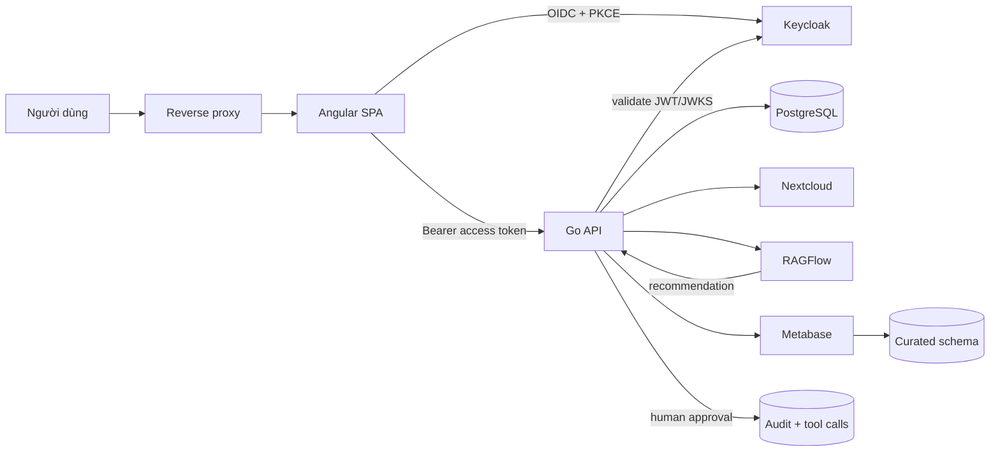
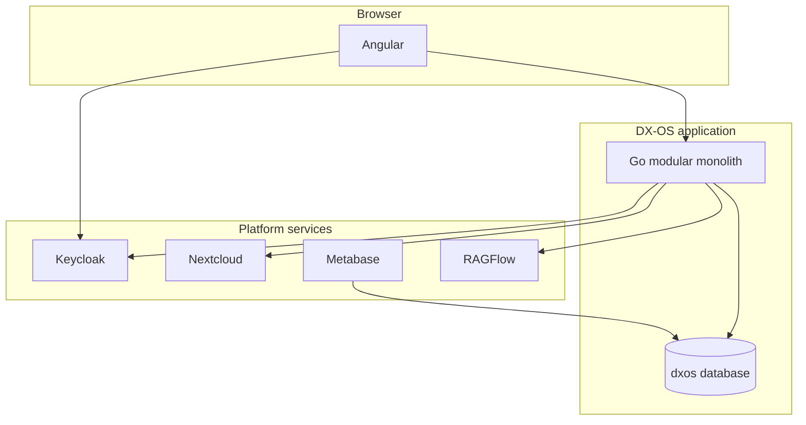

# Kiến trúc hệ thống mục tiêu

## 1. Bối cảnh hệ thống



## 2. Container view



Go API là một deployable unit nhưng chia module nghiệp vụ bên trong. Angular là SPA được build thành
static files. Mỗi nền tảng bên thứ ba giữ database/account riêng.

## 3. Module Go

| Module | Trách nhiệm |
|---|---|
| `identity` | ánh xạ Keycloak subject với user/department nội bộ |
| `organization` | organization, department và cost center |
| `purchase` | phiếu, item, tổng tiền và validation |
| `workflow` | transition, assignment, SLA và process event |
| `document` | metadata và adapter Nextcloud |
| `analytics` | query KPI/read model cho dashboard |
| `ai` | RAG request, recommendation và evaluation |
| `agent` | approval, tool allowlist, execution và idempotency |
| `audit` | append-only audit và truy vấn cho auditor |
| `integration` | webhook, outbox, retry và dead-letter |

Module không truy cập table riêng của module khác qua SQL tùy ý. Giao tiếp nội bộ qua service
interface nhỏ hoặc query được sở hữu rõ ràng; chưa cần network call giữa module.

## 4. Ranh giới trách nhiệm

| Thành phần | Sở hữu | Không được làm |
|---|---|---|
| Angular | presentation, form state, navigation | quyết định quyền cuối cùng hoặc giữ business rule duy nhất |
| Go API | business rule, authorization, transaction, integration | phát hành mật khẩu/token người dùng |
| Keycloak | identity, OIDC session, realm role | quyết định ownership và trạng thái hồ sơ |
| PostgreSQL | operational, audit, outbox, curated schema | cho Agent truy cập trực tiếp |
| Nextcloud | file/version | lưu trạng thái workflow chính |
| Metabase | dashboard/read-only query | cập nhật operational data |
| RAGFlow | retrieval, answer, recommendation | gọi database/shell hoặc tự thực thi hành động nhạy cảm |

## 5. Luồng đăng nhập

1. Angular chuyển người dùng đến Keycloak bằng Authorization Code + PKCE.
2. Keycloak xác thực và trả authorization code.
3. Angular đổi code lấy access token ngắn hạn.
4. Angular gửi token trong `Authorization: Bearer`.
5. Go API kiểm chữ ký, issuer, audience, expiry và required role từ JWKS.
6. Go API tiếp tục kiểm ownership, department scope và trạng thái nghiệp vụ.

Frontend guard chỉ cải thiện UX; không thay thế backend authorization.

## 6. Luồng quy trình

1. Employee tạo draft trong Go API.
2. Submit tạo một transition trong transaction.
3. Service kiểm attachment, budget, duplicate và quyền.
4. `purchase_requests.status`, `process_events`, `audit_logs` và `outbox_events` được ghi atomically.
5. Worker xử lý outbox để gửi notification/cập nhật tích hợp.
6. Manager/finance thực hiện transition tiếp theo với optimistic locking.

## 7. Luồng Agent

```text
RAGFlow phân tích
-> Go lưu recommendation
-> người có role xem và approve
-> Go kiểm lại quyền + precondition
-> Go gọi tool allowlist
-> lưu tool input/output đã redact
-> ghi audit và trạng thái cuối
```

Approval không đồng nghĩa execution: hệ thống kiểm lại trạng thái ngay trước khi chạy để tránh
time-of-check/time-of-use.

## 8. Tích hợp và consistency

- REST synchronous cho thao tác cần phản hồi ngay.
- Transactional outbox cho notification và đồng bộ không đồng bộ.
- `Idempotency-Key` cho submit/transition/tool execution.
- Retry exponential backoff có giới hạn; lỗi cuối vào dead-letter table.
- `event_id`, `event_type`, `event_version`, `occurred_at`, `subject_id`, `actor_id`.
- Không dùng distributed transaction trong MVP.

## 9. Topology theo môi trường

| Môi trường | Đặc điểm |
|---|---|
| Local | Angular dev server, Go local, platform services qua Compose |
| Dev/Integration | tất cả container, dữ liệu test dùng chung |
| Demo/UAT | version pin, dataset cố định, HTTPS, reset script |
| Production pilot | TLS/domain thật, secret manager, backup, monitoring và data approval |

