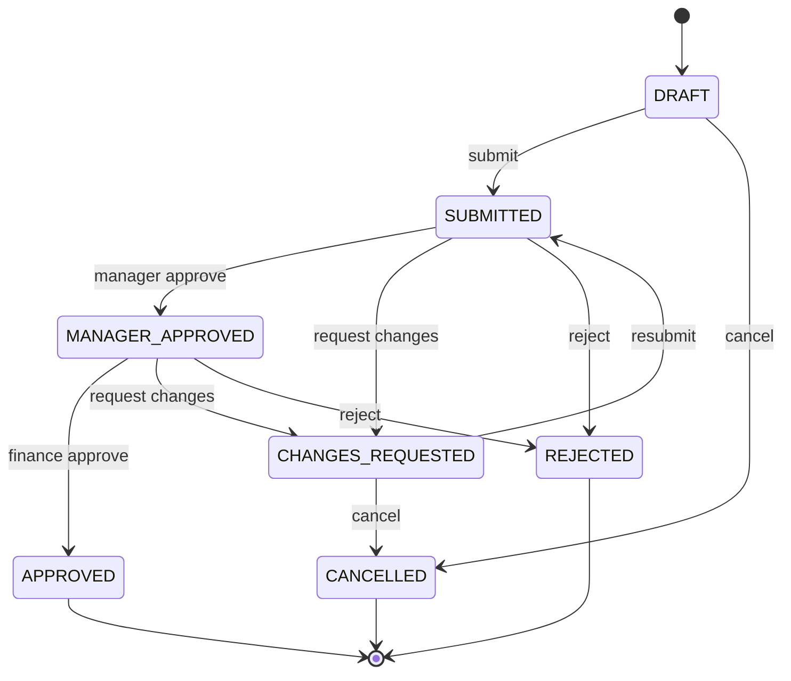

# Backend Go

## 1. Mục tiêu

Backend là một modular monolith chịu trách nhiệm business rule, state transition, authorization,
transaction, integration và audit. Một binary `api` phục vụ HTTP; một binary `worker` xử lý outbox,
notification và tác vụ nền.

## 2. Lựa chọn kỹ thuật

| Nhu cầu | Lựa chọn |
|---|---|
| HTTP | `net/http` + router nhẹ như Chi |
| PostgreSQL | `pgx` |
| Query typed | `sqlc` |
| Migration | `golang-migrate` |
| Validation | validator ở transport + policy ở domain |
| Logging | structured JSON, `slog` |
| Observability | OpenTelemetry |
| API contract | OpenAPI 3.1 |
| Test | `testing`, `httptest`, testcontainers khi cần |

Không chọn ORM nặng cho MVP. SQL phải rõ ràng vì KPI, locking và transaction là phần quan trọng của
đồ án.

## 3. Bootstrap ứng dụng

Thứ tự khởi động:

1. đọc cấu hình từ environment;
2. validate tất cả biến bắt buộc;
3. khởi tạo logger/correlation;
4. kết nối PostgreSQL và ping;
5. tải OIDC discovery/JWKS;
6. khởi tạo clients Nextcloud/RAGFlow;
7. wire repositories và services;
8. đăng ký HTTP routes;
9. mở readiness khi dependencies bắt buộc sẵn sàng;
10. graceful shutdown khi nhận SIGTERM.

Không chạy migration âm thầm trong API production. Pipeline triển khai chạy migration bằng command
riêng trước khi rollout.

## 4. Module purchase

### Aggregate chính

`PurchaseRequest` chịu trách nhiệm:

- tổng tiền bằng tổng item;
- currency nhất quán;
- status hợp lệ;
- version cho optimistic locking;
- requester và department bất biến sau submit;
- chỉ transition qua method/service hợp lệ.

### State machine



`MANAGER_APPROVED` thể hiện đã qua cấp trưởng bộ phận và đang chờ tài chính. UI có thể hiển thị
nhãn “Chờ tài chính”.

### Rule tối thiểu

- Draft chỉ requester hoặc admin được sửa.
- Submit yêu cầu ít nhất một item và `total_amount > 0`.
- Nếu tổng tiền vượt ngưỡng cấu hình, phải có attachment loại `QUOTATION`.
- Requester không thể approve bất kỳ bước nào của phiếu mình tạo.
- Manager chỉ xử lý phiếu thuộc department được cấp.
- Finance kiểm budget còn đủ tại thời điểm approve.
- Transition dùng `expected_version`; xung đột trả 409.
- Transition lặp cùng `Idempotency-Key` trả kết quả cũ, không tạo event lần hai.

## 5. Transaction boundary

Một transition thành công ghi trong cùng transaction:

1. lock/select request theo `id` và `version`;
2. validate policy;
3. cập nhật status, assignee, timestamps và version;
4. ghi `process_events`;
5. ghi `audit_logs`;
6. ghi `outbox_events`;
7. commit.

Gọi Nextcloud/RAGFlow/notification sau commit qua worker, không giữ database transaction trong lúc
gọi network.

## 6. HTTP middleware

Thứ tự khuyến nghị:

```text
recover
-> request/correlation ID
-> structured access log
-> security headers/CORS
-> timeout/body limit
-> authentication
-> route authorization
-> handler
```

Các handler chỉ làm parse/validate transport, gọi service và map kết quả sang HTTP. Không đặt SQL hoặc
business rule trực tiếp trong handler.

## 7. Error model nội bộ

Service trả typed errors:

- `ErrNotFound`
- `ErrUnauthenticated`
- `ErrForbidden`
- `ErrValidation`
- `ErrConflict`
- `ErrPrecondition`
- `ErrDependencyUnavailable`

HTTP layer map sang Problem Details, không trả stack trace hoặc lỗi database cho client.

## 8. Worker

Worker xử lý:

- transactional outbox;
- notification;
- synchronization metadata;
- SLA scan;
- AI ingestion request;
- retry tool execution được phép retry.

Mỗi job có attempt, next attempt, last error và trạng thái. Retry chỉ áp dụng thao tác idempotent hoặc
có idempotency key.

## 9. Cấu hình

Các nhóm biến:

- `APP_*`: environment, public URL, log level.
- `HTTP_*`: port, timeout, body limit, trusted proxy.
- `DATABASE_*`: DSN/pool.
- `OIDC_*`: issuer, audience, client ID.
- `NEXTCLOUD_*`, `RAGFLOW_*`, `METABASE_*`.
- `AGENT_*`: tool allowlist, timeout, rate limit.

Ứng dụng phải fail fast nếu biến bắt buộc thiếu. Không có default password/secret.

## 10. Test backend

- Unit test policy/state transition dạng table-driven.
- Repository integration test với PostgreSQL thật.
- Handler test cho status code/problem details.
- Auth test với JWT fixture/JWKS test server.
- Concurrency test: hai approver cùng version chỉ một request thành công.
- Contract test kiểm OpenAPI và response thực tế.

