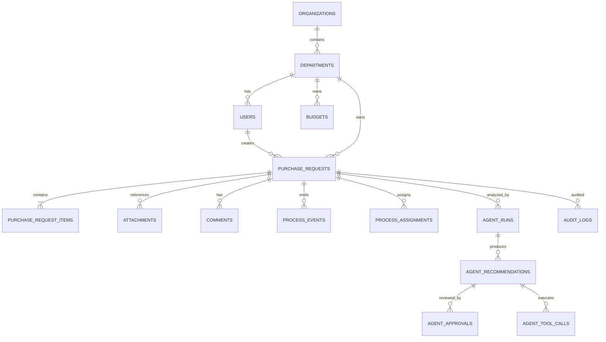

# Thiết kế cơ sở dữ liệu

## 1. Nguyên tắc

- PostgreSQL là nguồn sự thật cho nghiệp vụ DX-OS.
- Mỗi platform service có database/user riêng.
- Go API dùng role `dxos_app`, không dùng superuser.
- Migration là append-only và chạy theo thứ tự.
- Tiền dùng `numeric(19,4)`, không dùng float.
- Thời gian dùng `timestamptz` và lưu UTC.
- ID dùng UUID; mã hiển thị như `PR-2026-000001` là trường riêng.
- Mọi bảng nghiệp vụ có `created_at`, `updated_at`; đối tượng mutable có `version`.
- Không hard-delete hồ sơ đã submit; dùng trạng thái/retention policy.

## 2. ERD MVP



## 3. Bảng tổ chức

### `organizations`

| Cột | Kiểu | Ràng buộc |
|---|---|---|
| `id` | uuid | PK |
| `code` | varchar(50) | unique, not null |
| `name` | varchar(255) | not null |
| `status` | varchar(30) | ACTIVE/INACTIVE |

### `departments`

| Cột | Kiểu | Ràng buộc |
|---|---|---|
| `id` | uuid | PK |
| `organization_id` | uuid | FK |
| `parent_id` | uuid | nullable self FK |
| `code` | varchar(50) | unique trong organization |
| `name` | varchar(255) | not null |
| `cost_center` | varchar(100) | nullable |

### `users`

Đây là profile nghiệp vụ ánh xạ từ Keycloak, không lưu password.

| Cột | Kiểu | Ràng buộc |
|---|---|---|
| `id` | uuid | PK nội bộ |
| `keycloak_subject` | varchar(255) | unique, not null |
| `username` | varchar(150) | not null |
| `email` | varchar(255) | nullable |
| `display_name` | varchar(255) | not null |
| `department_id` | uuid | FK |
| `active` | boolean | default true |

## 4. Bảng nghiệp vụ

### `purchase_requests`

| Cột | Kiểu | Ghi chú |
|---|---|---|
| `id` | uuid | PK |
| `request_code` | varchar(30) | unique, sinh server-side |
| `requester_id` | uuid | FK users |
| `department_id` | uuid | scope dữ liệu |
| `title` | varchar(255) | not null |
| `reason` | text | not null |
| `currency` | char(3) | ISO 4217 |
| `total_amount` | numeric(19,4) | tính từ items |
| `cost_center` | varchar(100) | not null |
| `status` | varchar(40) | accepted values |
| `current_assignee_id` | uuid | nullable |
| `submitted_at` | timestamptz | nullable |
| `approved_at` | timestamptz | nullable |
| `sla_due_at` | timestamptz | nullable |
| `version` | bigint | optimistic locking |
| `created_at` | timestamptz | not null |
| `updated_at` | timestamptz | not null |

Check constraint cho status:

```text
DRAFT, SUBMITTED, MANAGER_APPROVED, CHANGES_REQUESTED,
APPROVED, REJECTED, CANCELLED
```

### `purchase_request_items`

| Cột | Kiểu |
|---|---|
| `id` | uuid |
| `purchase_request_id` | uuid FK |
| `line_number` | integer |
| `description` | varchar(500) |
| `quantity` | numeric(15,4) |
| `unit` | varchar(50) |
| `unit_price` | numeric(19,4) |
| `line_total` | numeric(19,4) |

Unique `(purchase_request_id, line_number)`. `line_total` được tính/kiểm tra server-side.

### `budgets`

| Cột | Kiểu |
|---|---|
| `id` | uuid |
| `department_id` | uuid FK |
| `fiscal_year` | integer |
| `cost_center` | varchar(100) |
| `currency` | char(3) |
| `allocated_amount` | numeric(19,4) |
| `reserved_amount` | numeric(19,4) |
| `spent_amount` | numeric(19,4) |
| `version` | bigint |

Unique `(department_id, fiscal_year, cost_center, currency)`. Finance approval phải lock budget row
để tránh overspend đồng thời.

## 5. Quy trình và audit

### `process_events`

Append-only timeline:

- `id`, `purchase_request_id`;
- `event_type`, `from_status`, `to_status`;
- `actor_id`, `actor_roles`;
- `comment`;
- `metadata jsonb`;
- `occurred_at`;
- `correlation_id`, `idempotency_key`.

Unique idempotency key trong phạm vi action/actor phù hợp.

### `process_assignments`

Lưu assignee hiện tại/lịch sử:

- request, step, assignee user/role;
- assigned/claimed/completed timestamps;
- outcome.

### `audit_logs`

- actor subject/user;
- action và resource type/id;
- request/correlation ID;
- source IP/user agent đã chuẩn hóa;
- result SUCCESS/DENIED/FAILED;
- before/after chỉ chứa field được phép;
- timestamp.

Không lưu access token, secret, raw document hoặc prompt chứa dữ liệu hạn chế nếu không cần.

## 6. File

`attachments` chỉ lưu metadata/reference:

- `id`, `purchase_request_id`;
- `document_type`;
- `nextcloud_file_id`, `path`, `etag`;
- `file_name`, `content_type`, `size_bytes`, `checksum`;
- `uploaded_by`, `uploaded_at`;
- `status` ACTIVE/QUARANTINED/DELETED.

Binary nằm trong Nextcloud, không lưu trùng vào PostgreSQL.

## 7. AI và Agent

### `agent_runs`

Lưu request phân tích, model/provider, prompt version, input reference, status, latency và token/cost
nếu provider cung cấp.

### `agent_recommendations`

Lưu recommendation dạng có cấu trúc:

- type;
- rationale;
- evidence/citations JSON;
- confidence;
- proposed tool + proposed input;
- status PENDING/APPROVED/REJECTED/EXECUTED/FAILED/EXPIRED.

### `agent_approvals`

Một quyết định của con người: recommendation, approver, decision, comment, approved snapshot hash và
timestamp.

### `agent_tool_calls`

- tool name/version;
- validated input/output đã redact;
- requested/approved by;
- idempotency key;
- execution status/attempt;
- started/completed time và error code.

## 8. Outbox

`outbox_events`:

- id/event type/version;
- aggregate type/id;
- payload JSONB;
- status PENDING/PROCESSING/PUBLISHED/FAILED/DEAD;
- attempts, next_attempt_at, last_error;
- created/published timestamps.

Worker claim theo `FOR UPDATE SKIP LOCKED`. Payload không chứa secret hoặc binary.

## 9. Index tối thiểu

- `purchase_requests(request_code)` unique.
- `purchase_requests(department_id, status, created_at desc)`.
- `purchase_requests(requester_id, created_at desc)`.
- `purchase_requests(current_assignee_id, status)`.
- `process_events(purchase_request_id, occurred_at)`.
- `audit_logs(resource_type, resource_id, occurred_at)`.
- `outbox_events(status, next_attempt_at)`.
- JSONB index chỉ tạo sau khi có query thực tế.

## 10. Migration và seed

- File: `000001_init.up.sql`, `000001_init.down.sql`.
- Down migration chỉ dùng local khi an toàn; production rollback ưu tiên forward fix/restore.
- Seed reference data tách khỏi migration schema.
- Demo seed deterministic và idempotent.
- Không đưa user password hoặc production-like PII vào seed.

